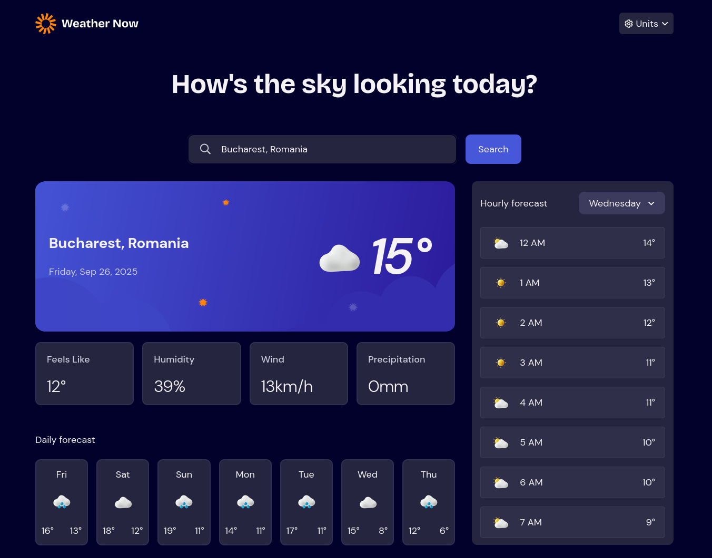

# Frontend Mentor - Weather app solution

This is a solution to the [Weather app challenge on Frontend Mentor](https://www.frontendmentor.io/challenges/weather-app-K1FhddVm49). Frontend Mentor challenges help you improve your coding skills by building realistic projects.

## Table of contents

- [Overview](#overview)
  - [The challenge](#the-challenge)
  - [Screenshot](#screenshot)
  - [Links](#links)
- [My process](#my-process)
  - [Built with](#built-with)
  - [What I learned](#what-i-learned)
  - [Continued development](#continued-development)
  - [Useful resources](#useful-resources)
- [Author](#author)

## Overview

### The challenge

Users should be able to:

- Search for weather information by entering a location in the search bar
- View current weather conditions including temperature, weather icon, and location details
- See additional weather metrics like "feels like" temperature, humidity percentage, wind speed, and precipitation amounts
- Browse a 7-day weather forecast with daily high/low temperatures and weather icons
- View an hourly forecast showing temperature changes throughout the day
- Switch between different days of the week using the day selector in the hourly forecast section
- Toggle between Imperial and Metric measurement units via the units dropdown
- Switch between specific temperature units (Celsius and Fahrenheit) and measurement units for wind speed (km/h and mph) and precipitation (millimeters) via the units dropdown
- View the optimal layout for the interface depending on their device's screen size
- See hover and focus states for all interactive elements on the page

### Screenshot



### Links

- Solution URL: [Add solution URL here](https://your-solution-url.com)
- Live Site URL: [Add live site URL here](https://your-live-site-url.com)

## My process

- **September 8th, 2025:** I created the github repo and I reused the contents of my calculator app solution because setting up React Testing Library to work correctly with Typescript is quite a pain. I created the component structure for the project and I also started working on the mobile version of the design.
- **September 9th, 2025:** I worked on the mobile version of the app, I picked up from where I left the design yesterday and I made my way through the app from top to bottom. I avoided implementing the functionality of the dropdowns or the search component, I just made them look like in the design.

### Built with

- Semantic HTML5 markup
- CSS custom properties
- Flexbox
- CSS Grid
- Mobile-first workflow
- [React](https://reactjs.org/) - JS library
- [TypeScript](https://www.typescriptlang.org/) - JavaScript with types
- [React Testing Library](https://testing-library.com/docs/react-testing-library/intro/) - For testing
- [TailwindCSS](https://tailwindcss.com/) - For styles
- [Vite](https://vite.dev/) - Build tool

### What I learned

Use this section to recap over some of your major learnings while working through this project. Writing these out and providing code samples of areas you want to highlight is a great way to reinforce your own knowledge.

To see how you can add code snippets, see below:

```html
<h1>Some HTML code I'm proud of</h1>
```

```css
.proud-of-this-css {
  color: papayawhip;
}
```

```js
const proudOfThisFunc = () => {
  console.log("🎉");
};
```

If you want more help with writing markdown, we'd recommend checking out [The Markdown Guide](https://www.markdownguide.org/) to learn more.

### Continued development

I would also add [storybook](https://storybook.js.org/) to this project, I don't know if I will have time until the Frontendmentor Hackathon time runs out, but I think I will add it nonetheless.

### Useful resources

- [React JS close dropdown using onBlur function](https://stackoverflow.com/a/73699297/12159189) - This helped me create a custom hook that I used to close the dropdowns when the user clicks outside of the dropdowns

## Author

- Frontend Mentor - [@florianstancioiu](https://www.frontendmentor.io/profile/florianstancioiu)
- Threads - [@florianstancioiu01](https://www.threads.com/@florianstancioiu01)
- LinkedIn - [florianstancioiu](https://www.linkedin.com/in/florian-stancioiu-765661349/)
- freeCodeCamp - [florianstancioiu](https://www.freecodecamp.org/florianstancioiu)
